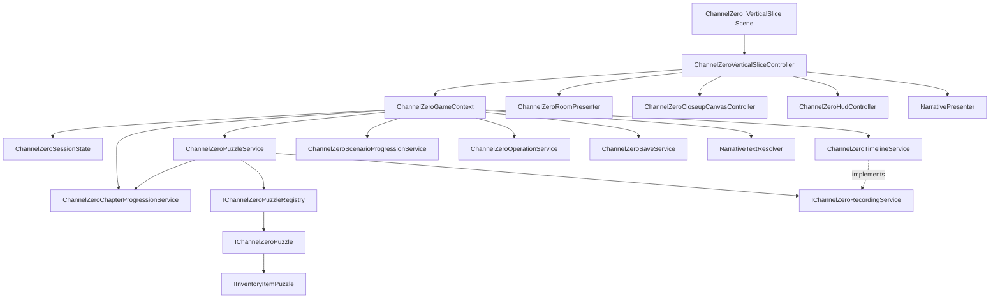

# Channel Zero 코드 구조

## 1. 활성 빌드 범위

- 활성 씬: `Assets/Scenes/ChannelZero_VerticalSlice.unity`
- 활성 런타임: `Assets/ChannelZero/Runtime`
- 자동 검증: `Assets/ChannelZero/Tests`
- 콘텐츠 데이터: `Assets/Resources/ChannelZero/Data`
- `Assets/Script`는 비활성 프로토타입 씬 전용 레거시 계층이다.
- 활성 빌드 씬이 `Assets/Script`를 참조하면 아키텍처 테스트가 실패한다.

## 2. 폴더 트리

```text
Assets/ChannelZero
├─ Runtime
│  ├─ Core
│  │  ├─ ChannelZeroGameContext          조립 지점(composition root)
│  │  ├─ ChannelZeroSessionState         저장 가능한 단일 세션 상태
│  │  ├─ ChannelZeroStateModel           상태 지속성/방/연도 분류
│  │  ├─ ChannelZeroSaveService          저장, 백업, 마이그레이션
│  │  ├─ ChannelZeroGameServices         인벤토리·이동·시간·CRT 명령
│  │  ├─ ChannelZeroScenarioProgression  위치/시나리오 해금 규칙
│  │  ├─ ChannelZeroPuzzleContracts      퍼즐·아이템·REC 인터페이스
│  │  ├─ ChannelZeroPuzzleService        퍼즐 실행과 장 완료 경계
│  │  ├─ ChannelZeroBuiltInPuzzles       1·2장 퍼즐 구현과 레지스트리
│  │  ├─ *Catalog / *RuntimeData         JSON·에셋 데이터 해석
│  │  └─ Narrative*                      조건부 대사 조회
│  └─ Presentation
│     ├─ ChannelZeroVerticalSliceController  씬 입력 흐름 조정
│     ├─ ChannelZeroRoomPresenter            방 배경·핫스팟 표시
│     ├─ ChannelZeroCloseupCanvasController  클로즈업·퍼즐 UI
│     ├─ ChannelZeroHudController            인벤토리·CRT HUD
│     ├─ NarrativePresenter                  TMP 대사 출력
│     └─ *Hotspot / *ActionButton            입력 어댑터
├─ Tests
│  ├─ EditMode   상태·서비스·데이터·구조 검증
│  └─ PlayMode   실제 씬 상호작용 완주 검증
└─ Data          ScriptableObject 카탈로그

Assets/Resources/ChannelZero
├─ Data          퍼즐·상호작용·대사·핫스팟 JSON
├─ Closeups      연도/상태별 클로즈업 이미지
├─ PlayRooms     방·연도별 배경
├─ Fonts         TMP 한글 폰트
└─ UI            CRT HUD 리소스
```

## 3. 런타임 클래스 흐름



## 4. 책임 규칙

1. `SessionState`만 저장 대상 상태를 보유한다. UI 컴포넌트는 진행 상태를 소유하지 않는다.
2. 퍼즐 구현은 `IChannelZeroPuzzle`을 구현하고 UI 오브젝트를 직접 찾지 않는다.
3. 아이템을 받는 퍼즐만 `IInventoryItemPuzzle`을 추가 구현한다.
4. REC 기록은 `IChannelZeroRecordingService` 한 경로로만 생성한다.
5. 퍼즐 실행 후 장 완료 판정은 `ChannelZeroPuzzleService`가 한 번 수행한다.
6. 컨트롤러는 결과를 화면에 전달하며 퍼즐 규칙을 직접 구현하지 않는다.
7. 데이터 추가는 JSON 정의와 레지스트리 팩토리 확장으로 처리한다.
8. 비활성 프로토타입 코드는 활성 빌드 씬에서 참조하지 않는다.

## 5. 퍼즐 추가 순서

```text
PuzzleDefinition JSON
  → ChannelZeroBuiltInPuzzleRegistry 팩토리 등록
  → IChannelZeroPuzzle 구현
  → 필요 시 IInventoryItemPuzzle 구현
  → InteractionRoute JSON 연결
  → EditMode 상태 테스트
  → PlayMode 씬 클릭 테스트
```

## 6. 레거시 분류

`Assets/Script`의 코드는 `00_Prologue`, `InGame`, `ChannelZero_LivingRoom2001` 같은 비활성 프로토타입 씬에서만 사용한다. 해당 씬을 보존하기 위해 직렬화 참조가 남은 클래스는 삭제하지 않는다. 어디에서도 참조되지 않던 빈 `InteractionController`와, 현재 클로즈업 시스템으로 대체된 `ChannelZeroZoomPanelController`는 제거했다.
